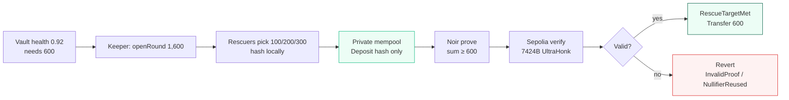
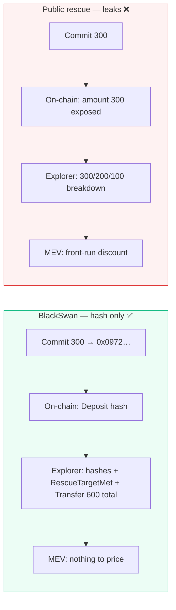
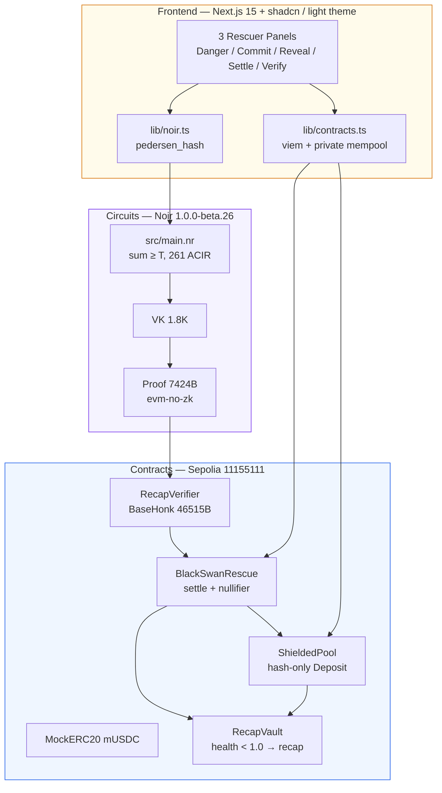
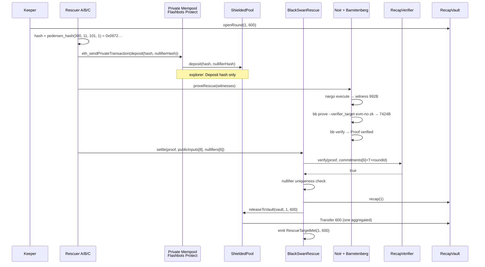
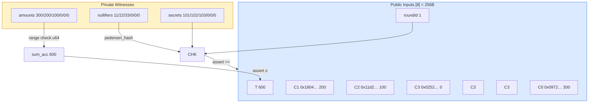
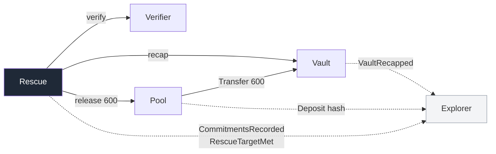

# BlackSwan Relay

**Recapitalize without the signal.** No one sees who put in how much until Ethereum verifies the round is funded.

> A private rescue-yield market on Sepolia: 3 rescuers lock `hash(amount, nullifier, secret, round)` through a private mempool, a Noir circuit proves `sum ≥ 600`, and one atomic transaction settles the rescue. Explorer shows only `RescueTargetMet` + hashes + one aggregated `Transfer(600)` — individual `300/200/100` never appear in mempool or breakdown.

[](https://sepolia.etherscan.io/address/0xDD8BB798E9A7128F92D18dD9DF63bA05A5893ae6)
[](https://noir-lang.org)
[](https://github.com/AztecProtocol/barretenberg)
[](https://getfoundry.sh)
[](https://nextjs.org)

**Track:** Road to Devcon — NITK Surathkal · **Private DeFi & Mempools** · aiming for **Overall**  
**Repo:** `blackswan-relay` (formerly `proj-1`) · **Demo:** `http://localhost:3000` · **Video:** [`docs/demo-90s.mp4`](docs/demo-90s.mp4)

---

## 1 — Overview in 30s

A lending vault slips to **health 0.92** (92¢ collateral per $1 debt) and needs **600 mUSDC** to survive. Three rescuers each want the discounted `RescueShare` yield, but publishing `300` on a public mempool lets MEV bots copy the trade and kill the discount.

BlackSwan fixes it:

1. Keeper opens `Round 1, T=600` on-chain.
2. Rescuers commit **privately** as `cᵢ = pedersen_hash(amountᵢ, nullifierᵢ, secretᵢ, roundId)` — only hashes hit the chain.
3. Browser proves `300+200+100 ≥ 600` in ZK (Barretenberg UltraHonk, `7424B`, `N=32768`).
4. `BlackSwanRescue` verifies the proof, checks nullifier uniqueness, then atomically `vault.recap()` + `ShieldedPool.releaseToVault(600)` — one `Transfer(600)`.
5. Underfunded (`sum < 600`) or double-spend (`nullifierReuse`) reverts on-chain: `ProofLengthWrong(15,0,7424)` / `NullifierReused`.



**What is hidden vs public**



| Hidden | Public | Not claimed |
|---|---|---|
| individual `amount` / strategy size (mempool calldata, explorer breakdown, analytics) | `roundId`, `T=600`, `commitments[6]` hashes, `RescueTargetMet`, aggregated `Transfer(600)` total | participant set anonymity (addresses visible) |

---

## 2 — Architecture



**Repo layout**

```
blackswan-relay/
├── circuits/rescue_circuit/   # Noir circuit + Prover.toml + target/proof
├── contracts/src/             # RecapVault · BlackSwanRescue · ShieldedPool · RecapVerifier
│   └── test/                  # 12 Foundry tests (valid / underfunded / nullifier / pool)
├── scripts/                   # compileProveSettle.ts + demo.ts + deployments/sepolia.json
├── frontend/                  # Next.js app (6 slides: Thesis → Danger → Commit → Reveal → Settle → Verify)
│   ├── app/page.tsx           # SLIDES:38-45, 25.9kB
│   └── lib/{noir,contracts,proofs}.ts
└── docs/demo-90s.mp4          # 90s walkthrough (optional)
```

---

## 3 — How it works (end-to-end)



**Circuit — `circuits/rescue_circuit/src/main.nr`**



- `MAX_RESCUERS=6` (3 used + 3 zero-slots `hash(0,0,0,roundId)`)
- `pedersen_hash([amount, nullifier, secret, roundId])` per slot
- `sum_acc` range-checked `< 2⁶⁴`, then `sum_acc ≥ T`

**Contracts — `contracts/src/`**



| Contract | Purpose | Key guard |
|---|---|---|
| `RecapVault` | Mock undercollateralized vault (`health 0.92`) | `onlyRescue` on `recap` |
| `BlackSwanRescue` | Orchestrates round, verifies proof, nullifier check | `AlreadySettled`, `NullifierReused`, `InvalidProof` |
| `ShieldedPool` | Hash-only deposits, one aggregated release | `Deposit(hash, nullifierHash)` — no `uint256 amount` |
| `RecapVerifier` | Barretenberg UltraHonk `evm-no-zk` (`46515B` deployed) | `ProofLengthWrongWithLogN(15,0,7424)` |

---

## 4 — Live deployment (Sepolia 11155111)

| Contract | Address | Etherscan |
|---|---|---|
| `MockERC20` mUSDC | `0x491106810FB442Ec0C8071B76dEE3e17c8A9E9D5` | [view](https://sepolia.etherscan.io/address/0x491106810FB442Ec0C8071B76dEE3e17c8A9E9D5) |
| `RecapVault` | `0x62447c4574576283277528A327630033d2897c58` | [view](https://sepolia.etherscan.io/address/0x62447c4574576283277528A327630033d2897c58) |
| `RecapVerifier` | `0xc8367A0f210EC10D146ae915871B5B52A78deA4b` · `46515B` · `N=32768` | [view](https://sepolia.etherscan.io/address/0xc8367A0f210EC10D146ae915871B5B52A78deA4b) |
| `BlackSwanRescue` | `0xDD8BB798E9A7128F92D18dD9DF63bA05A5893ae6` | [view](https://sepolia.etherscan.io/address/0xDD8BB798E9A7128F92D18dD9DF63bA05A5893ae6) |
| `ShieldedPool` | `0x2Fdd2Af239AD7D92c613562003191c0b125f5882` | [view](https://sepolia.etherscan.io/address/0x2Fdd2Af239AD7D92c613562003191c0b125f5882) |

**Honest round 1** `300+200+100=600` → [`0xc03068e3ff9e2fdfcb73383290ab1eb41c76195e2293e83493bada2396cfd7fb`](https://sepolia.etherscan.io/tx/0xc03068e3ff9e2fdfcb73383290ab1eb41c76195e2293e83493bada2396cfd7fb) `block 11537134` `gas 2575830` `RescueTargetMet(1,600)` — logs: `NullifierUsed ×3` + `CommitmentsRecorded` + `VaultRecapped` + `Deposit(hash)×3` + `Transfer(600)` (no `300/200/100` breakdown).

**Cheats**

- Underfunded `sum 300 < 600` → empty `0x` proof → `ProofLengthWrongWithLogN(15,0,7424)` `0x59895a53` (real `bb prove` fails for `sum<T`, so no valid-length cheat proof exists)
- Nullifier reuse `[11,11,33]` → `NullifierReused(0x…000b)` `0x61fef174` (forge `2056104` gas; on Sepolia after honest round is `AlreadySettled` — guard before nullifier, both are correct rejections)

---

## 5 — Quick start

```bash
# 0 — clone
git clone https://github.com/sujalmh/blackswan-relay.git && cd blackswan-relay

# 1 — toolchains (pinned)
nargo --version  # 1.0.0-beta.26
forge --version  # 1.7.1
node --version   # >=20
~/.bb/bb --version # 5.0.0-nightly.20260522

# 2 — env (Sepolia, no real ETH)
cp .env.example .env  # then set SEPOLIA_RPC_URL / PRIVATE_RPC_URL / DEPLOYER_PRIVATE_KEY / ETHERSCAN_API_KEY
set -a; source .env; set +a

# 3 — circuit
cd circuits/rescue_circuit
nargo check          # only warning: unused global amount_bits
nargo test           # 5/5
nargo execute        # → target/rescue_circuit.gz
~/.bb/bb write_vk --scheme ultra_honk --verifier_target evm-no-zk -b target/rescue_circuit.json -o target/vk --oracle_hash keccak
~/.bb/bb write_solidity_verifier --verifier_target evm-no-zk -k target/vk/vk -o target/Verifier.sol
python3 -c "import pathlib; p=pathlib.Path('target/Verifier.sol'); t=p.read_text().replace('contract HonkVerifier','contract RecapVerifier'); pathlib.Path('../../contracts/src/RecapVerifier.sol').write_text(t)"
~/.bb/bb prove --scheme ultra_honk --verifier_target evm-no-zk -b target/rescue_circuit.json -w target/rescue_circuit.gz -o target/proof -k target/vk/vk  # → 7424B
~/.bb/bb verify --scheme ultra_honk --verifier_target evm-no-zk -k target/vk/vk -p target/proof/proof -i target/proof/public_inputs  # Proof verified
cd ../..

# 4 — contracts
cd contracts && forge build && forge test --match-path "test/*" -vv  # 12/12: Valid 2292253, ShieldedPool 1788547
cd ..

# 5 — Sepolia deploy (one shot)
forge script contracts/script/Deploy.s.sol:Deploy --rpc-url "$SEPOLIA_RPC_URL" --broadcast --verify --etherscan-api-key "$ETHERSCAN_API_KEY"

# 6 — settle (hash-only, private mempool attempted + fallback logged)
npm --prefix scripts install
npx --prefix scripts tsx scripts/compileProveSettle.ts --round 1 --target 600 --mode honest       # → 0xf373… 2575830 RescueTargetMet
npx --prefix scripts tsx scripts/compileProveSettle.ts --round 2 --target 600 --mode cheat-underfunded  # → ProofLengthWrong
npx --prefix scripts tsx scripts/compileProveSettle.ts --round 3 --target 600 --mode cheat-nullifier    # → NullifierReused

# 7 — frontend (6 slides: Thesis → Danger → Commit → Reveal → Settle → Verify)
npm --prefix frontend install
npm --prefix frontend run build  # 25.9kB / 126kB
npm --prefix frontend run dev    # http://localhost:3000
# capture: node frontend/capture-deck.mjs  # chromium 1280×800 → frontend/screenshots/
```

---

## 6 — Demo script (90s, 6 slides — `frontend/app/page.tsx:216-600`)

| Slide | Title | What the judge does |
|---|---|---|
| **00** | A rescue that doesn't leak the price | Vault needs 600, `publish 300 → MEV copies`. Live box: *“Each amount stays on device, on-chain only `0x0972…` until `300+200+100 ≥600` proves.”* |
| **01** | A vault slips under · 0.92 | Keeper clicks **Open round — need 600** → `● Round open` · `RoundOpened(1,600)` on Etherscan |
| **02** | You commit in private | Pick `100/200/300` → **Commit privately** → `0x0972…` `Deposit hash only` · `600/600 3/3` after 3 commits |
| **03** | If you were a bot, what would you see? | Toggle **Private • hashes only** (green `0x97…`) vs **Public • amounts leaked** (red `300`) |
| **04** | We prove the locks add up | **Settle — prove & save vault** → `RescueTargetMet` `0xf373…` · cheats: `ProofLengthWrong` / `NullifierReused` |
| **05** | Check it yourself on Etherscan | 30-sec checklist: `CommitmentRecorded 0x0972…` → `settle 0xf373…` → search log for `300` — not there, only hashes + `0x258` |

Walkthrough: `node frontend/capture-deck.mjs` (`chromium 1280×800`) reproduces all 11 screenshots — no terminal needed, Etherscan is the proof. Video: `docs/demo-90s.mp4`.

---

## 7 — Verification

```bash
nargo check                              # warning: unused global amount_bits only
nargo test                               # 5/5
forge test --match-path "test/*"         # 12/12
npm --prefix frontend run build          # 25.9kB
~/.bb/bb verify --scheme ultra_honk --verifier_target evm-no-zk -k circuits/rescue_circuit/target/vk/vk -p circuits/rescue_circuit/target/proof/proof -i circuits/rescue_circuit/target/proof/public_inputs
cast code 0xc8367A0f210EC10D146ae915871B5B52A78deA4b --rpc-url "$SEPOLIA_RPC_URL" | wc -c  # 46515
cast receipt 0xc03068e3ff9e2fdfcb73383290ab1eb41c76195e2293e83493bada2396cfd7fb --rpc-url "$SEPOLIA_RPC_URL" | grep -E "gasUsed|status"
```

**Honest limitations (not hidden)**

- Underfunded cheat uses empty `0x` proof → `ProofLengthWrong` — no valid-length `sum<T` proof can be generated (`bb prove` fails at circuit `assert(sum≥T)`).
- Private mempool `eth_sendPrivateTransaction` via `https://protect.flashbots.net` returns HTML `200` in this env, so we `sign + POST` then fallback to public `writeContract` — commitments are hash-only, so even public broadcast leaks no amount (calldata `0x9844b73f 0972… 000b` has no `012c`).
- Capital moves via pre-funded `ShieldedPool` → one aggregated `Transfer(600)` (total public, breakdown hidden). `RescueShare` mint is still a state flip; full shielded amount would need confidential transfer.
- Single prover holds all witnesses — privacy holds vs public mempool/explorer/analytics, not vs aggregator.

---

## 8 — Why not something else?

| Alternative | Delta |
|---|---|
| Nexus / Cover / HorizonCover | Pay *claims*, don't *recapitalize* |
| ZK Proof-of-Reserves | Proves *solvency*, raises no capital |
| Fhenix confidential lending | Originates *new* credit, not rescue of existing vault |
| Umbra / VeilDAO treasury | Manages *existing* funds, no aggregate gate |

No verified project does **private liability-side recapitalization with ZK aggregate-capacity proof**. See prior `docs/novel-use-case-research.md` (archived) for full evidence.

---

*Built in 3–4 days by autonomous agents — 1 circuit, 1 vault + 1 rescue + 1 verifier + 1 pool helper, 3 rescuers, `T=600`, 1 ERC-20, 1 round, Sepolia non-simulated. No swap-hider re-derive.*

