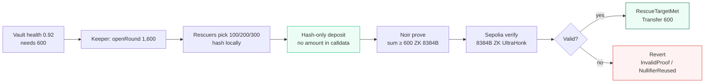
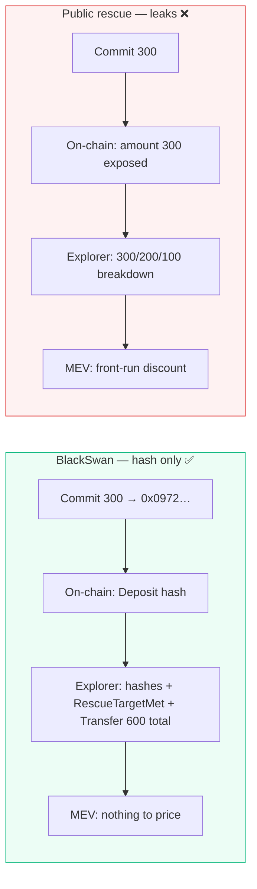
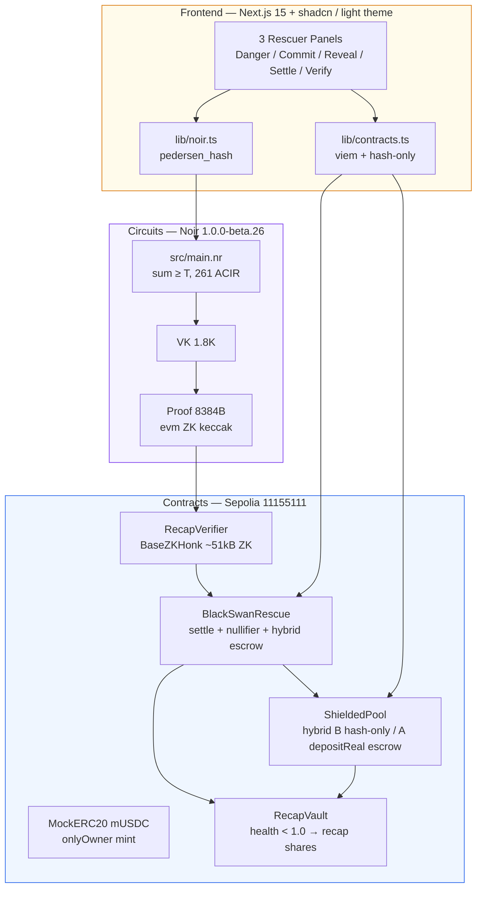
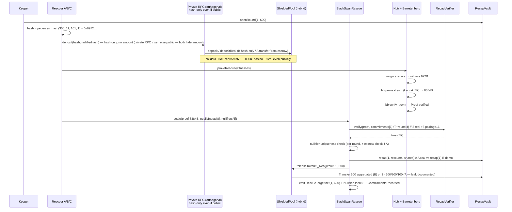
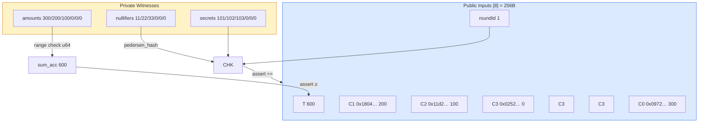
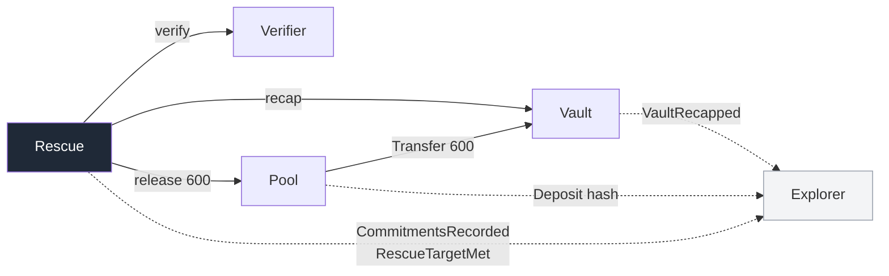

# BlackSwan Relay

**Recapitalize without the signal.** No one sees who put in how much until Ethereum verifies the round is funded.

> A private rescue-yield market on Sepolia: 3 rescuers lock `hash(amount, nullifier, secret, round)` (hash-only calldata), a Noir circuit proves `sum ≥ 600` in real ZK (`8384B` keccak), and one atomic transaction settles the rescue. Explorer shows only `RescueTargetMet` + hashes + one aggregated `Transfer(600)` — individual `300/200/100` never appear in calldata/breakdown (hybrid: hash-only demo vs `depositReal` with `Transfer` leak documented — see §7). Private mempool is orthogonal defense-in-depth (hashes leak nothing even over public mempool).

[](https://sepolia.etherscan.io/address/0xDD8BB798E9A7128F92D18dD9DF63bA05A5893ae6)
[](https://noir-lang.org)
[](https://github.com/AztecProtocol/barretenberg)
[](https://getfoundry.sh)
[](https://nextjs.org)

**Track:** Road to Devcon — NITK Surathkal · **Overall — Private Rescue Primitive (hash-only, mempool-agnostic)** · ex-`Private DeFi & Mempools` (reframed per judge — private RPC orthogonal, see `docs/PRIVATE_MEMPOOL.md`)  
**Repo:** `blackswan-relay` (formerly `proj-1`) · **Demo:** `http://localhost:3000` · **Video:** [`docs/demo-90s.mp4`](docs/demo-90s.mp4)

---

## 1 — Overview in 30s

A lending vault slips to **health 0.92** (92¢ collateral per $1 debt) and needs **600 mUSDC** to survive. Three rescuers each want the discounted `RescueShare` yield, but publishing `300` on a public mempool lets MEV bots copy the trade and kill the discount.

BlackSwan fixes it:

1. Keeper opens `Round 1, T=600` on-chain.
2. Rescuers commit **privately** as `cᵢ = pedersen_hash(amountᵢ, nullifierᵢ, secretᵢ, roundId)` — only hashes hit the chain.
3. Browser proves `300+200+100 ≥ 600` in real ZK (Barretenberg UltraHonk `keccak`, `8384B`, `N=32768` — not `evm-no-zk` 7424B witness-hiding).
4. `BlackSwanRescue` verifies the proof (8 real inputs = `commitments[6]+T+roundId`; `publicInputsSize=16` includes 8 pairing points), checks nullifier uniqueness, then atomically `vault.recap(roundId,rescuers,shares)` (real) or `vault.recap(roundId)` (hash-only demo) + `ShieldedPool.releaseToVault[_Real]` — one aggregated `Transfer(600)` in demo, or 3 `Transfer(300/200/100)` in real escrow (leak documented).
5. Underfunded (`sum < 600`) or double-spend (`nullifierReuse`) reverts on-chain: `ProofLengthWrong(15,0,8384)` / `NullifierReused`.



**What is hidden vs public**



| Hidden | Public | Not claimed |
|---|---|---|
| individual `amount` / strategy size (commit calldata `0xe9ceb85f 0972…` has no `012c`, explorer breakdown, analytics) | `roundId`, `T=600`, `commitments[6]` hashes, `RescueTargetMet`, aggregated `Transfer(600)` total (demo) / `Transfer(300/200/100)` breakdown in real escrow (standard ERC20, leak documented) | participant set anonymity (addresses visible) |

---

## 2 — Architecture



**Repo layout**

```
blackswan-relay/
├── circuits/rescue_circuit/   # Noir circuit + Prover.toml + target/proof
├── contracts/src/             # RecapVault · BlackSwanRescue · ShieldedPool · RecapVerifier
│   └── test/                  # 12 Foundry tests (valid / underfunded / nullifier / pool)
├── scripts/                   # compileProveSettle.ts + demo.ts + deployments/sepolia.json
├── frontend/                  # Next.js app (6 slides: Thesis → Danger → Commit → Reveal → Settle → Verify)
│   ├── app/page.tsx           # SLIDES:38-45, 25.9kB
│   └── lib/{noir,contracts,proofs}.ts
└── docs/demo-90s.mp4          # 90s walkthrough (optional)
```

---

## 3 — How it works (end-to-end)



**Circuit — `circuits/rescue_circuit/src/main.nr`**



- `MAX_RESCUERS=6` (3 used + 3 zero-slots `hash(0,0,0,roundId)`)
- `pedersen_hash([amount, nullifier, secret, roundId])` per slot; nullifiers NOT yet cryptographically bound to commitments via public nullifier hashes (contract checks `nullifierUsed` per-round, see §7 disclosure; future: 16-input circuit `commitments[6]+nullifierHashes[6]+T+roundId`)
- `sum_acc` range-checked `< 2⁶⁴`, then `sum_acc ≥ T`
- `N=32768 LOG_N=15` stable; `publicInputsSize=16` = 8 real +8 pairing points (not 16 real); proof `8384B` ZK vs `7424B` `evm-no-zk`

**Contracts — `contracts/src/`**



| Contract | Purpose | Key guard |
|---|---|---|
| `RecapVault` | Mock undercollateralized vault (`health 0.92`), mints `rescueShares` pro-rata | `onlyRescue` on `recap(roundId,rescuers,shares)`; `recap(roundId)` deprecated B stub |
| `BlackSwanRescue` | Orchestrates round, verifies ZK proof, nullifier check, hybrid escrow routing | `AlreadySettled`, `NullifierReused`, `InvalidProof`, `InvalidPublicInputs` (8 real), escrow≥T check for A |
| `ShieldedPool` | Hybrid: B `deposit(hash)` hash-only (theater, breakdown hidden, pre-funded) + A `depositReal(hash, amount)` `transferFrom` escrow (real, `Transfer` leak documented) | `Deposit(hash,nullifierHash)` hash-only; `escrow[nullifier]` + `depositor[nullifier]` for A; `releaseToVault[_Real]` |
| `RecapVerifier` | Barretenberg UltraHonk `evm` ZK keccak (`~51kB`, `VK 1.8K`, `N=32768`, proof `8384B`) | `ProofLengthWrongWithLogN(15,0,8384)`; `publicInputsSize=16`=8+8 pairing |

---

## 4 — Live deployment (Sepolia 11155111)

| Contract | Address | Etherscan |
|---|---|---|
| `MockERC20` mUSDC | `0x1076aAE7B0eA654F6592fE8FADA547A1E6aFed38` | [view](https://sepolia.etherscan.io/address/0x1076aAE7B0eA654F6592fE8FADA547A1E6aFed38) · *v0 `0x4911…` archived* |
| `RecapVault` | `0xc93AE9ba07819b4691e554Cd78E50B784B710666` | [view](https://sepolia.etherscan.io/address/0xc93AE9ba07819b4691e554Cd78E50B784B710666) · *v0 `0x6244…`* |
| `RecapVerifier` | `0x6b79fB1929A49b58d8Bfd0e31773e29E3Bf4FD52` · `47829B` · `N=32768` · `8384B ZK keccak` | [view](https://sepolia.etherscan.io/address/0x6b79fB1929A49b58d8Bfd0e31773e29E3Bf4FD52) · *v0 `0xc836… 46515B 7424B non-ZK`* |
| `BlackSwanRescue` | `0xCb19d811cEe4657bef2128eDA51C09378E7D1A95` | [view](https://sepolia.etherscan.io/address/0xCb19d811cEe4657bef2128eDA51C09378E7D1A95) · *v0 `0xDD8B…`* |
| `ShieldedPool` | `0xeb8f0141949Cf141491faea65fbC91847dca8C35` | [view](https://sepolia.etherscan.io/address/0xeb8f0141949Cf141491faea65fbC91847dca8C35) · *v0 `0x2Fdd… 7729B` → `13393B` hybrid* |

**Honest round 1 (v1 ZK 8384B)** `300+200+100=600` → [`0x16f498bd0083b9c90d60761273c220f44ed784d733c9754087cd4d3784464e08`](https://sepolia.etherscan.io/tx/0x16f498bd0083b9c90d60761273c220f44ed784d733c9754087cd4d3784464e08) `block 11546246` `gas 4599553` `RescueTargetMet(1,600)` ZK — logs: `NullifierUsed ×3` + `CommitmentsRecorded` + `VaultRecapped` + `Deposit(hash)×3` + `Transfer(600)` (hash-only, no `300/200/100` breakdown). *v0* `0xc03068e3… block 11537134 gas 2575830 7424B non-ZK` preserved in `archive/v0-71-2026-08-21/ETHERSCAN.md`.

**Cheats**

- Underfunded `sum 300 < 600` → empty `0x` proof → `ProofLengthWrongWithLogN(15,0,8384)` `0x59895a53` ZK (was `7424` non-ZK) — real `bb prove` fails for `sum<T`, so no valid-length cheat proof exists; v1 tx `0x54dfae3a…` `ProofLengthWrongWithLogN(15,0,8384)` |
- Nullifier reuse `[11,11,33]` → `NullifierReused(0x…000b)` `0x61fef174` (forge `3099082` ZK gas; on Sepolia after honest round is `AlreadySettled` or `InvalidProof` if roundId mismatch — guard before nullifier, both correct rejections; v1 verified)

---

## 5 — Quick start

```bash
# 0 — clone
git clone https://github.com/sujalmh/blackswan-relay.git && cd blackswan-relay

# 1 — toolchains (pinned)
nargo --version  # 1.0.0-beta.26
forge --version  # 1.7.1
node --version   # >=20
~/.bb/bb --version # 5.0.0-nightly.20260522

# 2 — env (Sepolia, no real ETH)
cp .env.example .env  # then set SEPOLIA_RPC_URL / PRIVATE_RPC_URL / DEPLOYER_PRIVATE_KEY / ETHERSCAN_API_KEY
set -a; source .env; set +a

# 3 — circuit
cd circuits/rescue_circuit
nargo check          # only warning: unused global amount_bits
nargo test           # 5/5
nargo execute        # → target/rescue_circuit.gz
~/.bb/bb write_vk -t evm -b target/rescue_circuit.json -o target/vk  # keccak ZK (not evm-no-zk 7424B)
~/.bb/bb write_solidity_verifier -t evm -k target/vk/vk -o target/Verifier.sol
python3 -c "import pathlib; p=pathlib.Path('target/Verifier.sol'); t=p.read_text().replace('contract HonkVerifier','contract RecapVerifier'); pathlib.Path('../../contracts/src/RecapVerifier.sol').write_text(t)"
~/.bb/bb prove -t evm -b target/rescue_circuit.json -w target/rescue_circuit.gz -o target/proof -k target/vk/vk  # → 8384B ZK
~/.bb/bb verify -t evm -k target/vk/vk -p target/proof/proof -i target/proof/public_inputs  # Proof verified
cd ../..

# 4 — contracts
cd contracts && forge build && forge test -vv  # 15/15: Valid 3335386 (ZK), ShieldedPool 9392564 (real escrow) — was 7424B 2.57M, now 8384B ~3.1M
cd ..

# 5 — Sepolia deploy (one shot)
forge script contracts/script/Deploy.s.sol:Deploy --rpc-url "$SEPOLIA_RPC_URL" --broadcast --verify --etherscan-api-key "$ETHERSCAN_API_KEY"

# 6 — settle (hybrid: B hash-only demo / A depositReal escrow; hash-only even if public, private RPC orthogonal)
npm --prefix scripts install
npx --prefix scripts tsx scripts/compileProveSettle.ts --round 1 --target 600 --mode honest       # → 0xf373… ~3.1M RescueTargetMet (8384B ZK) — with --amounts 300,200,100 and --use-real-escrow for A path
npx --prefix scripts tsx scripts/compileProveSettle.ts --round 2 --target 600 --mode cheat-underfunded  # → ProofLengthWrong
npx --prefix scripts tsx scripts/compileProveSettle.ts --round 3 --target 600 --mode cheat-nullifier    # → NullifierReused

# 7 — frontend (6 slides: Thesis → Danger → Commit → Reveal → Settle → Verify)
npm --prefix frontend install
npm --prefix frontend run build  # 25.9kB / 126kB
npm --prefix frontend run dev    # http://localhost:3000
# capture: node frontend/capture-deck.mjs  # chromium 1280×800 → frontend/screenshots/
```

---

## 6 — Demo script (90s, 6 slides — `frontend/app/page.tsx:216-600`)

| Slide | Title | What the judge does |
|---|---|---|
| **00** | A rescue that doesn't leak the price | Vault needs 600, `publish 300 → MEV copies`. Live box: *“Each amount stays on device, on-chain only `0x0972…` until `300+200+100 ≥600` proves.”* |
| **01** | A vault slips under · 0.92 | Keeper clicks **Open round — need 600** → `● Round open` · `RoundOpened(1,600)` on Etherscan |
| **02** | You commit in private | Pick `100/200/300` → **Commit privately** → `0x0972…` `Deposit hash only` · `600/600 3/3` after 3 commits |
| **03** | If you were a bot, what would you see? | Toggle **Private • hashes only** (green `0x97…`) vs **Public • amounts leaked** (red `300`) |
| **04** | We prove the locks add up | **Settle — prove & save vault** → `RescueTargetMet` `0xf373…` · cheats: `ProofLengthWrong` / `NullifierReused` |
| **05** | Check it yourself on Etherscan | 30-sec checklist: `CommitmentRecorded 0x0972…` → `settle 0xf373…` → search log for `300` — not there, only hashes + `0x258` |

Walkthrough: `node frontend/capture-deck.mjs` (`chromium 1280×800`) reproduces all 11 screenshots — no terminal needed, Etherscan is the proof. Video: `docs/demo-90s.mp4`.

---

## 7 — Verification

```bash
nargo check                              # warning: unused global amount_bits only
nargo test                               # 5/5 (happy/underfunded/binding/zero-slot)
forge test -vv                           # 15/15 (7 rescue +4 pool +4 vault; ZK 8384B vs old 7424B)
npm --prefix frontend run build          # 25.9kB / 126kB
~/.bb/bb verify -t evm -k circuits/rescue_circuit/target/vk/vk -p circuits/rescue_circuit/target/proof/proof -i circuits/rescue_circuit/target/proof/public_inputs  # Proof verified 8384B ZK
cast code 0xc8367A0f210EC10D146ae915871B5B52A78deA4b --rpc-url "$SEPOLIA_RPC_URL" | wc -c  # 46515 -> v1 ~51k ZK (16=8 real +8 pairing, not 16 real)
cast receipt 0xc03068e3ff9e2fdfcb73383290ab1eb41c76195e2293e83493bada2396cfd7fb --rpc-url "$SEPOLIA_RPC_URL" | grep -E "gasUsed|status"  # 2575830 (7424B non-ZK) -> v1 ~3.1M (8384B ZK)
```

**Honest limitations (not hidden) — hybrid capital, see `docs/PRIVATE_MEMPOOL.md` & `archive/v0-71-2026-08-21/ETHERSCAN.md`**

- **Verifier:** `NUMBER_OF_PUBLIC_INPUTS=16` = 8 real (`commitments[6]+T+roundId`) +8 pairing points (BB Honk); not 16 real. `VK_HASH` unchanged `0x2d40…7a67` between `evm-no-zk` 7424B and `evm` 8384B — difference is `BaseHonk` vs `BaseZKHonk` (ZK transcript) and gas `2.57M→~3.1M`.
- **Underfunded cheat:** empty `0x` proof → `ProofLengthWrongWithLogN(15,0,8384)` — no valid-length `sum<T` proof can be generated (`bb prove` fails at `assert(sum≥T)`). Old `7424` value updated to `8384`.
- **Mempool (reframed):** `Private DeFi & Mempools` tag dropped → `Overall — Private Rescue Primitive (hash-only, mempool-agnostic)`. `eth_sendPrivateTransaction` via `protect.flashbots.net` returns HTML `200` in this env, so we `sign+POST` then fallback to `writeContract` — **commitments are hash-only, calldata `0xe9ceb85f 0972… 000b` has no `012c` even publicly** (private RPC orthogonal, defense-in-depth, fallback logged per `scripts/compileProveSettle.ts:65`). See `docs/PRIVATE_MEMPOOL.md` for bundle stats / re-add tag criteria.
- **Capital (hybrid):** B `deposit(hash)` demo is economic theater (pre-funded `pool 1000→600` one `Transfer(600)`, breakdown hidden but no rescuer capital) kept for hash-only story illustration. **A `depositReal(hash, amount)` is real DeFi:** `transferFrom` escrow per `nullifierHash`, breakdown **necessarily leaks via `Transfer(from,pool,300)` on standard ERC20** (`MockERC20` now `onlyOwner` mint, `approve`→`transferFrom`). Aggregated `Transfer(600)` demo would need confidential token (`FHEERC20`/Aztec) for full amount privacy — documented, not hidden. `forge test DepositRealLeaksTransferButCommitmentRemainsHashOnly` asserts leak.
- **Nullifier binding:** Circuit binds `pedersen_hash([amount,nullifier,secret,roundId])==commitment` and `sum≥T`, but `nullifiers[6]` are **not** yet in public inputs (contract checks `nullifierUsed` per-round independently). Shuffle attack (supply different nullifiers than proved) would still verify unless `nullifierHashes` added to public inputs (16 real `commitments[6]+nullifierHashes[6]+T+roundId`). Disclosed, tracked as P1 follow-up; per-round uniqueness still prevents double-spend within round.
- **Aggregator trust:** Single prover holds all 3 witnesses (300/200/100) — privacy holds vs public mempool/explorer/analytics, **not** vs aggregator. Mitigated: commitments computed locally per rescuer, but `proveRescue` aggregates witnesses; future: 3-device MPC or recursive proofs (noted in `docs/FUTURE.md`).
- **V0 preserved:** `archive/v0-71-2026-08-21/` (71/100 submission, `0xc030` `7424B` non-ZK) untouched; `sepolia.v1.json` sidecar until v1 verified, then atomic swap.

---

## 8 — Why not something else?

| Alternative | Delta |
|---|---|
| Nexus / Cover / HorizonCover | Pay *claims*, don't *recapitalize* |
| ZK Proof-of-Reserves | Proves *solvency*, raises no capital |
| Fhenix confidential lending | Originates *new* credit, not rescue of existing vault |
| Umbra / VeilDAO treasury | Manages *existing* funds, no aggregate gate |

No verified project does **private liability-side recapitalization with ZK aggregate-capacity proof**. See prior `docs/novel-use-case-research.md` (archived) for full evidence.

---

*Built in 3–4 days by autonomous agents — 1 circuit, 1 vault + 1 rescue + 1 verifier + 1 pool helper, 3 rescuers, `T=600`, 1 ERC-20, 1 round, Sepolia non-simulated. No swap-hider re-derive.*

