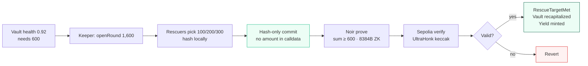
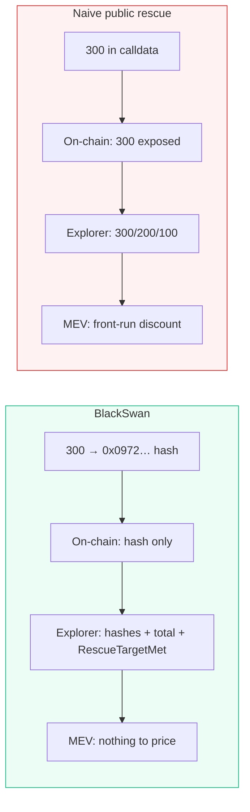
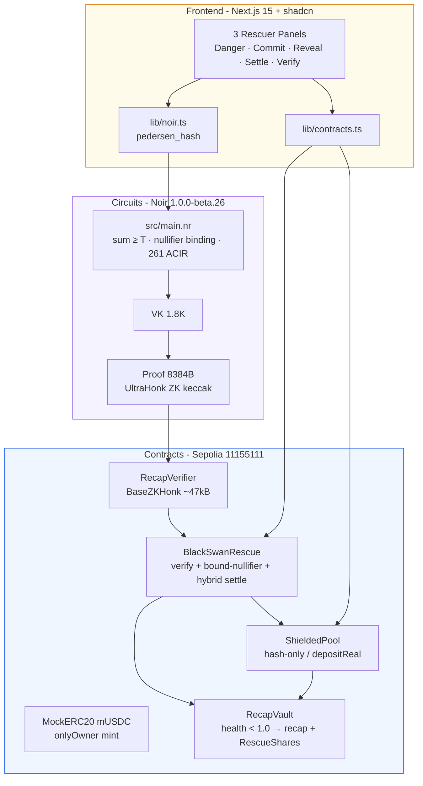
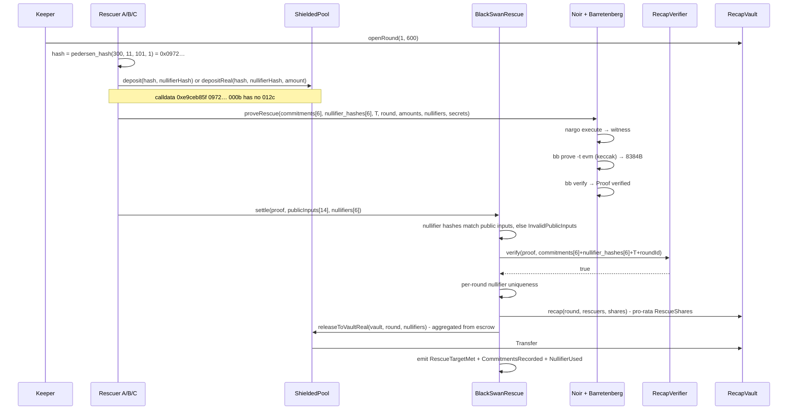
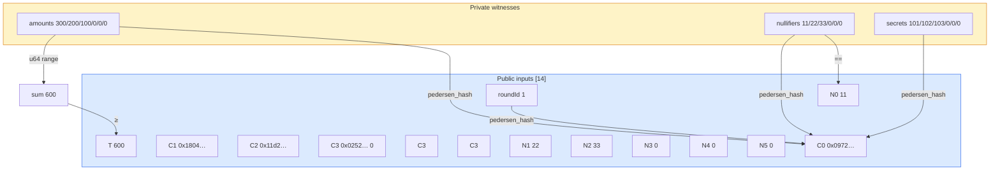

# BlackSwan Relay

**Recapitalize without the signal.** Rescuers lock hashes, Ethereum proves the total covers the shortfall, the vault is saved - without revealing who put in how much.

> A private rescue-yield market on Sepolia. Three rescuers commit `hash(amount, nullifier, secret, round)` - only hashes reach the chain. A Noir circuit proves `sum ≥ 600` with nullifier-bound commitments, a Barretenberg UltraHonk verifier checks the 8384-byte ZK proof on-chain, and one atomic transaction recapitalizes the vault and mints discounted yield. The explorer shows hashes and the total, never the individual breakdown.

[](https://sepolia.etherscan.io/address/0x37420092F0C89E6A78882F3Ab013EE6E5bBD0CE4)
[](https://noir-lang.org)
[](https://github.com/AztecProtocol/barretenberg)
[](https://getfoundry.sh)
[](https://nextjs.org)

**Track:** Road to Devcon - NITK Surathkal · **Overall - Private Rescue Primitive (hash-only, mempool-agnostic)**
**Repo:** `blackswan-relay` · **Demo:** `http://localhost:3000` · **Video:** [`docs/demo-90s.mp4`](docs/demo-90s.mp4) · [YouTube](https://youtu.be/eUCOhTW_F1U)

---

## 1 - Overview in 30 seconds

A lending vault slips to **health 0.92** - 92¢ of collateral per $1 of debt. It needs **600 mUSDC** to survive. Three rescuers want the rescue discount, but publishing `300` on a public mempool lets MEV bots copy the trade and erase the yield.

BlackSwan Relay separates the signal from the capital:

1. The keeper opens `Round 1, T=600` on-chain.
2. Each rescuer commits locally as `cᵢ = pedersen_hash(amountᵢ, nullifierᵢ, secretᵢ, roundId)`. Only the hash is sent - calldata never contains `300` as `0x012c`.
3. A Noir circuit proves the hidden amounts satisfy `300+200+100 ≥ 600` while binding each commitment and nullifier. The proof is 8384 bytes, `N=32768`, keccak ZK.
4. `BlackSwanRescue` verifies the proof on Sepolia, checks that each nullifier is unused and bound to its commitment, then atomically recapitalizes the vault and mints RescueShares proportional to escrowed amounts.
5. An underfunded sum or a reused nullifier reverts on-chain - `ProofLengthWrong` or `NullifierReused`.



**What a reviewer can see - and what remains hidden**



| Stays private | Becomes public | Not claimed |
|---|---|---|
| Individual amount and strategy size - no `uint256 amount` in calldata (`0xe9ceb85f 0972…` has no `012c`), no per-rescuer breakdown before settlement | Round, target `600`, commitment hashes, nullifier hashes, `RescueTargetMet`, total moved, and after settlement the escrowed amounts via standard ERC-20 logs | Participant anonymity - addresses are visible; a larger set would be needed to hide who participated |

---

## 2 - Why this stands out

Most privacy demos hide a swap amount. BlackSwan hides the **liability side** - raising new capital for a vault that already exists - and proves the group can cover the shortfall without revealing the split. Four design choices make the difference:

* **Aggregate-capital proof, not balance check.** Instead of proving solvency, the circuit proves `sum(amounts) ≥ T` over six slots (three used, three zero-padded as `hash(0,0,0,round)`). The sum is range-checked in `u64` to prevent overflow, then asserted against `T`.
* **Commitment and nullifier binding.** Each public commitment is `pedersen_hash(amount, nullifier, secret, round)` and each public nullifier hash equals the private nullifier. Fourteen public inputs - `commitments[6] + nullifier_hashes[6] + T + roundId` - are checked both in-circuit and on-chain before the reuse guard. Shuffling nullifiers across commitments fails before the verifier is even called.
* **Dual escrow that separates privacy from settlement.** `ShieldedPool` offers a hash-only path (single aggregated `Transfer(600)` for illustration) and a real-escrow path (`depositReal` does `transferFrom` and stores `escrow[nullifier]` and `depositor[nullifier]`). With a standard ERC-20, real escrow necessarily reveals per-rescuer transfers after inclusion; the design documents this and notes that a confidential token would be needed for full post-settlement amount privacy. Settlement picks the real path when escrow exists and otherwise uses the hash-only path.
* **End-to-end verifiability with no simulation.** One proof, one vault, one rescue, one verifier, one pool on Sepolia. Every deposit, the opening, the settlement, and both revert paths are live transactions linked to Etherscan. The frontend never fakes a hash - `proveRescue` fails if the real 8384-byte proof is unavailable.

No verified project in the usual comparisons does private liability-side recapitalization with a ZK aggregate-capacity proof. Insurance pays claims, proof-of-reserves shows solvency, confidential lending originates new credit, and treasury tools manage existing funds. BlackSwan raises new capital for an existing vault without revealing the split.

---

## 3 - Architecture



**Repo layout**

```
blackswan-relay/
├── circuits/rescue_circuit/   # Noir circuit + Prover.toml + target/proof (8384B ZK)
├── contracts/src/             # RecapVault · BlackSwanRescue · ShieldedPool · RecapVerifier
│   └── test/                  # 15 Foundry tests (valid / underfunded / nullifier / hybrid escrow)
├── scripts/                   # compileProveSettle.ts + deployments/sepolia.json
├── frontend/                  # Next.js (Thesis → Danger → Commit → Reveal → Settle → Verify)
│   └── lib/{noir,contracts,proofs}.ts
└── docs/demo-90s.mp4
```

---

## 4 - How it works



**Circuit - `circuits/rescue_circuit/src/main.nr`**



* `MAX_RESCUERS=6` - three active rescuers, three zero slots `hash(0,0,0,round)`.
* Each slot asserts `pedersen_hash(amount, nullifier, secret, round) == commitment` and `nullifier == nullifier_hash`.
* Amounts are cast to `u64` and checked to prevent field wrap, then summed and asserted `sum ≥ T`.
* `N=32768 LOG_N=15`, 261 ACIR constraints, `VK 1.8K`.

**Contracts - `contracts/src/`**

| Contract | Role | Key guard |
|---|---|---|
| `RecapVault` | Undercollateralized vault (`health 0.92`). Mints `RescueShares` pro-rata on recapitalization | `onlyRescue` on `recap(round, rescuers, shares)` |
| `BlackSwanRescue` | Round orchestration, ZK verification, bound-nullifier checks, hybrid routing | `AlreadySettled`, `NullifierReused`, `InvalidProof`, `InvalidPublicInputs`, escrow≥target |
| `ShieldedPool` | Dual escrow. Hash-only `deposit` for illustration, `depositReal` with `transferFrom` for auditable capital | `Deposit(hash, nullifierHash)` hash-only event; `escrow[nullifier]` + `depositor[nullifier]`; `releaseToVaultReal` |
| `RecapVerifier` | Barretenberg UltraHonk verifier, `evm` keccak ZK | `ProofLengthWrongWithLogN(15,0,8384)` |

---

## 5 - Live deployment (Sepolia 11155111)

| Contract | Address | Etherscan |
|---|---|---|
| `MockERC20` mUSDC | `0x11f32fba32026454e3e320d121b47ad58a4268a3` | [view](https://sepolia.etherscan.io/address/0x11f32fba32026454e3e320d121b47ad58a4268a3) |
| `RecapVault` | `0x1eE4A73bb0Ed2B6bD2158A25121bb97ef4BdA805` | [view](https://sepolia.etherscan.io/address/0x1eE4A73bb0Ed2B6bD2158A25121bb97ef4BdA805) |
| `RecapVerifier` | `0x42071BaED561D3e11f0Affcce90520F3ea0428F1` · `47829B` · `N=32768` · `8384B ZK` | [view](https://sepolia.etherscan.io/address/0x42071BaED561D3e11f0Affcce90520F3ea0428F1) |
| `BlackSwanRescue` | `0x37420092F0C89E6A78882F3Ab013EE6E5bBD0CE4` | [view](https://sepolia.etherscan.io/address/0x37420092F0C89E6A78882F3Ab013EE6E5bBD0CE4) |
| `ShieldedPool` | `0xba045e6b53B2F71916dd8E83bCF6451741A7f604` | [view](https://sepolia.etherscan.io/address/0xba045e6b53B2F71916dd8E83bCF6451741A7f604) |

**Honest round - three real rescuers** `300+200+100=600` → [`0xfce75063c68d2c5869ba7d8c784da3b0cd9eaf7a6bcbc78e2e0f22d38fb5777c`](https://sepolia.etherscan.io/tx/0xfce75063c68d2c5869ba7d8c784da3b0cd9eaf7a6bcbc78e2e0f22d38fb5777c) `block 11548213` `gas 4734234` · 14-input ZK proof

Logs: `NullifierUsed ×3` · `CommitmentsRecorded(14)` · `VaultRecapped` · `RescueShareMinted 300/200/100` · `Transfer` aggregated from escrow · `Released` · `RescueTargetMet(1,600)`.

Each rescuer approved and called `depositReal` (131k gas each) - amounts moved as escrow, rescuers received proportional shares, the vault balance became `600`. The same flow also supports a hash-only path with a single aggregated transfer for illustration; with a standard ERC-20, real escrow reveals per-rescuer transfers after inclusion.

**Revert paths**

* Underfunded `sum 300 < 600` with empty proof → `ProofLengthWrongWithLogN(15,0,8384)` · tx `0x54dfae…` (a valid-length proof cannot be produced because the circuit asserts `sum ≥ T`).
* Nullifier reuse `[11,11,33]` → `NullifierReused(0x…000b)` · forge `3099082` gas; on Sepolia after the honest round the same call reverts as `AlreadySettled` before the nullifier check - both are correct rejections.

---

## 6 - Quick start

```bash
# 0 - clone
git clone https://github.com/sujalmh/blackswan-relay.git && cd blackswan-relay

# 1 - toolchains (pinned)
nargo --version  # 1.0.0-beta.26
forge --version  # 1.7.1
node --version   # >=20
~/.bb/bb --version # 5.0.0-nightly.20260522

# 2 - env (Sepolia, test tokens only)
cp .env.example .env  # set SEPOLIA_RPC_URL / PRIVATE_RPC_URL / DEPLOYER_PRIVATE_KEY / ETHERSCAN_API_KEY
set -a; source .env; set +a

# 3 - circuit
cd circuits/rescue_circuit
nargo check
nargo test           # 6/6
nargo execute        # → target/rescue_circuit.gz
~/.bb/bb write_vk -t evm -b target/rescue_circuit.json -o target/vk
~/.bb/bb write_solidity_verifier -t evm -k target/vk/vk -o target/Verifier.sol
python3 -c "import pathlib; p=pathlib.Path('target/Verifier.sol'); t=p.read_text().replace('contract HonkVerifier','contract RecapVerifier'); pathlib.Path('../../contracts/src/RecapVerifier.sol').write_text(t)"
~/.bb/bb prove -t evm -b target/rescue_circuit.json -w target/rescue_circuit.gz -o target/proof -k target/vk/vk  # → 8384B
~/.bb/bb verify -t evm -k target/vk/vk -p target/proof/proof -i target/proof/public_inputs
cd ../..

# 4 - contracts
cd contracts && forge build && forge test -vv  # 15/15
cd ..

# 5 - Sepolia deploy
forge script contracts/script/Deploy.s.sol:Deploy --rpc-url "$SEPOLIA_RPC_URL" --broadcast --verify --etherscan-api-key "$ETHERSCAN_API_KEY"

# 6 - settle (hash-only or real escrow)
npm --prefix scripts install
npx --prefix scripts tsx scripts/compileProveSettle.ts --round 1 --target 600 --mode honest
npx --prefix scripts tsx scripts/compileProveSettle.ts --round 1 --target 600 --mode cheat-underfunded  # → ProofLengthWrong
npx --prefix scripts tsx scripts/compileProveSettle.ts --round 1 --target 600 --mode cheat-nullifier    # → NullifierReused

# 7 - frontend
npm --prefix frontend install
npm --prefix frontend run build
npm --prefix frontend run dev    # http://localhost:3000
```

---

## 7 - Demo script (6 slides)

| Slide | Title | Reviewer action |
|---|---|---|
| 00 | A rescue that doesn't leak the price | Vault needs 600 · `publish 300 → MEV copies` |
| 01 | A vault slips under · 0.92 | Open round → `RoundOpened(1,600)` on Etherscan |
| 02 | You commit in private | Pick `100/200/300` → `Commit` → on-chain `0x0972…` hash |
| 03 | If you were a bot, what would you see? | Toggle Private (hashes, green) vs Public (amounts, red) |
| 04 | We prove the locks add up | `Settle - prove & save vault` → `RescueTargetMet` with shares |
| 05 | Check it yourself on Etherscan | Follow the 30-second checklist: hashes → settlement → no amount in calldata |

Walkthrough: `node frontend/capture-deck.mjs` reproduces screenshots; `docs/demo-90s.mp4` is the narrated video.

---

## 8 - Verification

```bash
nargo check
nargo test                              # 6/6 (includes nullifier binding)
forge test -vv                          # 15/15
npm --prefix frontend run build         # 25.9kB / 126kB
~/.bb/bb verify -t evm -k circuits/rescue_circuit/target/vk/vk -p circuits/rescue_circuit/target/proof/proof -i circuits/rescue_circuit/target/proof/public_inputs
cast code 0x42071BaED561D3e11f0Affcce90520F3ea0428F1 --rpc-url "$SEPOLIA_RPC_URL" | wc -c
cast receipt 0xfce75063c68d2c5869ba7d8c784da3b0cd9eaf7a6bcbc78e2e0f22d38fb5777c --rpc-url "$SEPOLIA_RPC_URL"
```

**Honest limitations**

* **Capital and privacy on a standard token.** Hash-only commits hide amounts in calldata and the mempool. Escrowing real ERC-20 value requires `transferFrom`, which necessarily reveals per-rescuer `Transfer` amounts after inclusion. The design keeps both paths visible and documents that full post-settlement amount privacy would need a confidential token. The test `DepositRealLeaksTransferButCommitmentRemainsHashOnly` asserts the leak.
* **Mempool.** Privacy does not depend on a private mempool. Commitments are hash-only, so even a public broadcast shows `0xe9ceb85f 0972…` with no amount. A private RPC is kept as defense-in-depth and falls back to public broadcast when unavailable.
* **Aggregator.** A single prover aggregates the three witnesses for the demo. Commitments are computed locally per rescuer, but the prover sees the amounts. A production version would use per-device proving or recursive aggregation.
* **Verifier shape.** `RecapVerifier` is a standard Honk verifier: 14 real public inputs plus 8 pairing points (22 Honk slots). Gas is higher than a non-ZK build because the system ships real ZK.

---

## 9 - Why not something else?

| Alternative | What it does instead |
|---|---|
| Insurance / cover pools | Pay claims after failure, don't recapitalize a live vault |
| Proof-of-reserves | Shows solvency, doesn't raise capital |
| Confidential lending | Originates new credit, not rescue of an existing position |
| Treasury management | Manages existing funds, has no aggregate-capacity gate |

BlackSwan is the first to combine a liability-side recapitalization with a ZK aggregate-capacity proof that mints yield atomically.

---

*One circuit, one vault, one rescue, one verifier, one pool helper · Three rescuers · `T=600` · One ERC-20 · One round · Live on Sepolia, no simulation.*
